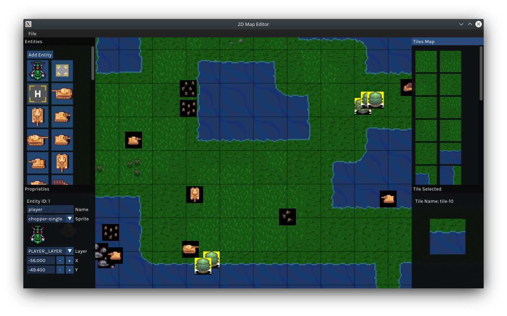

# 2D Game Map Editor

This editor is a project that I did myself, for the challenge of [Gustavo Pezzi](https://github.com/gustavopezzi), who put in his course [Fundamentals of 2D Game Engines with C++ SDL and Lua ]( https://www.udemy.com/course/cpp-2d-game-engine/ ). The Editor has a lot of bugs, I don't implement many things, but it is the best I can do now, I hope that in the future I can will improve it. I do this project to learn more about Game Developmet and practice my skills.



## Dependences
* [GLEW 2.2.0](http://glew.sourceforge.net/)
* [GLFW 3.3.8](https://www.glfw.org/)
* [ImGui 1.89.8](https://github.com/ocornut/imgui)
* [TinyXML2 9.0.0](https://github.com/leethomason/tinyxml2/tree/bfbcc0333d1a24ec8d9e10d14116d00dbdedf043)
* [GLM 0.9.8](https://github.com/g-truc/glm/tree/89e52e327d7a3ae61eb402850ba36ac4dd111987)
* [STB(stb_image)](https://github.com/nothings/stb/tree/f54acd4e13430c5122cab4ca657705c84aa61b08)
* [Lua 5.4.4](https://www.lua.org/)
* [SOL2 3.3.0](https://github.com/ThePhD/sol2)
* [{fmt} 10.0.0](https://github.com/fmtlib/fmt/tree/cbddab2fe21c0051eebf46f2e6f20925a160fc04)

## Build
All the third-party dependencies are installed using [conan](https://conan.io/)

### Requirements
* CMake >= 3.18
* conan >= 2.0.5

First execute the setup script for install all necessary dependencies

### Linux
* GCC >= 13

```
./setup.sh
cmake -DCMAKE_BUILD_TYPE=Release -G "Unix Makefiles" -DCMAKE_TOOLCHAIN_FILE=build/release/conan_toolchain.cmake -S . -B ~/build/release
cmake --build ~/build/release --target RavenEditor -- -j X
```

### Window
* Visual Studio >= 22
```
.\setup.bat
cmake -DCMAKE_BUILD_TYPE=Release -G "Visual Studio 17 2022" -DCMAKE_TOOLCHAIN_FILE="build\release\conan_toolchain.cmake" -S . -B ~/build/release
cmake --build ~/build/release --target RavenEditor --config Release
```